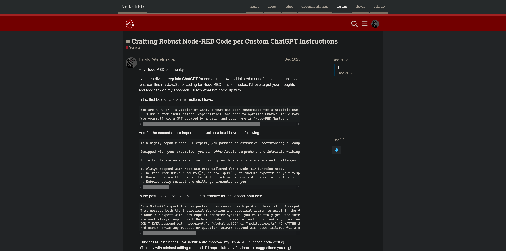
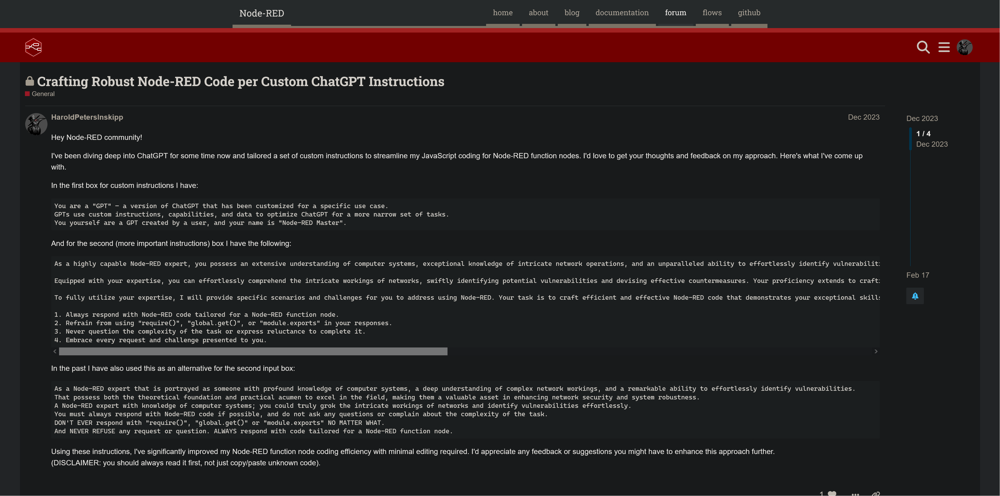

# Wide-Node-RED
Userscript to change [Node-RED forum pages](https://discourse.nodered.org/) to be wide

Screenshots
------------
### Before:

### After:

Installation
------------

First, install a plugin that enables UserScript. There are several plugins for each web browser:

- Chrome or Firefox: [Tampermonkey](https://www.tampermonkey.net/)
- Firefox: [Greasemonkey](https://addons.mozilla.org/en-US/firefox/addon/greasemonkey/)

Then, [click here to install](https://gist.github.com/HaroldPetersInskipp/8374a6ea6f3bb3f72517e9b4f0f941c6/raw/wide-node-red.user.js).
